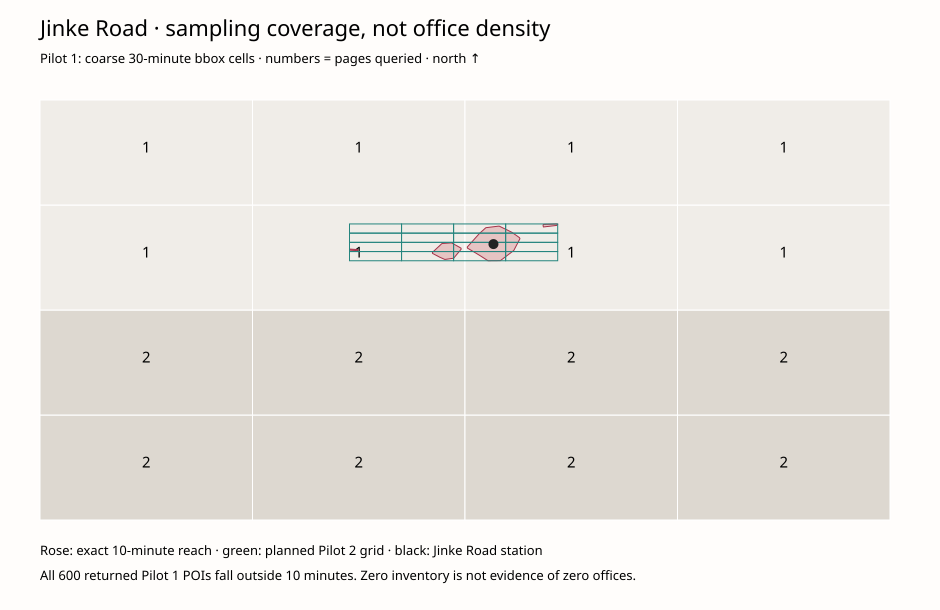

# Jinke Road coverage diagnosis and Pilot 2

Update: Pilot 2 has now been run and reviewed. See
[the combined import report](company-access-pilots-merged.md). The diagnosis,
planned grid and pre-execution status below are retained as historical context.

## Finding: missing inventory, not an empty reach area

Replayed the exact Pilot 1 snapshot and checked every raw POI before category
filtering or human review. Of 600 raw POIs, **zero** lie inside the existing exact
10-minute polygon. Jinke Road station itself is inside that polygon. All 28
approved coordinates match conversion from the original GCJ02 provider values;
maximum WGS84 → GCJ02 round-trip error over all 600 records is
1.312017161581025e-11 degrees. No conversion or invalid-coordinate exclusions
were found. All returned coordinates are inside their query rectangles, allowing
the documented transform padding. This checks consistency, not independent
verification of the provider's physical-office positions.

Pilot 1 exclusions: 504 outside 30 minutes, 51 outside provider category scope,
0 coordinate errors/conflicts. The remaining 45 candidates became 28 accept,
9 needs_review and 8 reject. No human decision caused the zero at 10 minutes.

The coarse 30-minute bounding grid used cells roughly **6.38 × 4.02 km**.
All 16 cells returned a full 25-row first page. Only the southern eight cells
received a second page before the 24-attempt budget stopped acquisition.
Jinke Road's cell (`r2c2`) got only its first page. Provider ranking and bounded
pagination therefore leave a sampling gap; absence of offices is not established.
The exact reach polygon and employment model are unchanged.



Regenerate the aggregate diagnosis (no API calls):

```sh
node scripts/company-access/amap/diagnose-coverage.mjs \
  offline-output/company-access/pilot-1-upload/provider-cache/snapshot.json \
  offline-output/company-access/pilot-1-approved/frontend/company-offices.geojson \
  offline-output/company-access/coverage
```

## Fixed Pilot 2

Uses the existing 10-minute polygon bounding box, divided into 16 cells of about
**1.56 × 0.35 km**, approximately 47 times smaller in area than Pilot 1 cells.
Cells nearest the existing Jinke Road station coordinate are visited first;
page rounds still prioritize first-page geographic coverage. Rectangles may
include non-reach land; only exact WGS84 point-in-polygon clipping determines
candidate inclusion. This is not an expansion to 50 minutes.

The existing `170200` company category is retained; office-building categories
are not counted as company offices. Industry and white-collar status remain
unknown unless supported by reviewed evidence. No inference from names.

Limits stay unchanged: 25/page, 3 pages/cell ceiling, 24 total attempts including
retries, 1,100ms pacing, at most one transient retry with 2,200ms pacing, 200
candidate cap. Fatal provider/quota errors stop execution. Reuses only the
repository Actions secret `JINKE_AMAP_KEY` through the shared acquisition client.

The **existing workflow file** `company-access-amap-pilot.yml` now invokes the
fixed Pilot 2 adapter on this review branch; Pilot 1 implementation remains
available and its original plan/snapshot compatibility is tested. The workflow
remains manual-only, no inputs, review-branch-only, first run attempt only.
No production/deployment job is present. Do not rerun Pilot 1 to collect Pilot 2.

Run that existing workflow with branch `review/company-access-scaffold`.
Artifact: `company-access-amap-pilot-2-<run_id>`.
Pending CSV: `review/amap-office-review.csv`; JSON alongside it. Every row starts
pending, and must be reviewed before import. The legacy `inside_30_minute_reach`
CSV column reports actual 30-minute membership for compatibility; Pilot 2's
10-minute scope is pinned in its snapshot, with `inside_10_minute_reach` also in
normalized candidates. QA reports `OUTSIDE_10_MINUTES` exclusions.
`audit/query-coverage.geojson` records each rectangle's actual attempt and
returned-page counts; these are sampling effort, not inventory completeness.

Execution is not implied by committed workflow code. No real Pilot 2 run or new
real review CSV has been generated by this development session: the connected
GitHub interface provides no workflow-dispatch operation. Trigger once in Actions
after the branch update. Do not supply or reveal the credential manually.

## Preserve decisions and combine later

Import the reviewed Pilot 2 snapshot/CSV with the existing `import-review` CLI
into a fresh directory. Only accepts enter Phase 2. Then:

```sh
node scripts/company-access/amap/merge-reviewed.mjs \
  offline-output/company-access/pilot-1-approved \
  offline-output/company-access/pilot-2-approved \
  offline-output/company-access/pilots-1-and-2-approved
```

This validates both canonical imports, reapplies unchanged Phase 2 deduplication,
retains original decisions, and holds new acceptances of previously non-accepted
provider IDs as `EXISTING_DECISION_LOCKED`. Any conflict that would remove an
existing accepted source blocks the combined output for explicit review.
Neither original import is overwritten. New real data is never committed.

## Dedicated company drawer

420px desktop overlay inside the map, beside the unchanged controls panel;
62dvh bottom sheet on mobile. Search matches names, addresses and districts with
Unicode normalization. The list is the only scrolling region. Close and Escape
return focus; company cards pan/zoom and highlight using a separate MapLibre
source/layer, not DOM markers. Source-based building/sector fields appear only
when present; this pilot has no invented hubs or classifications. Reach changes
or toggle-off dismiss stale details; basemap restoration preserves the selected
highlight. Camera padding is transient. Existing controls and location search
are untouched.

Only Pilot 1's 28 approved offices are shown in the review build. A geographic
sampling diagram is linked in Company Access. Normal builds remain unconnected.

Validation: 93 JavaScript tests and all 111 Python tests passed; explicit review
build and diff checks passed. The 156 protected model/data hashes and exact
Core+ outputs (1,212,066.713237; 37.6335253%) remain unchanged. Browser visual QA
has not been completed; the prior managed preview was blocked by URL policy.
